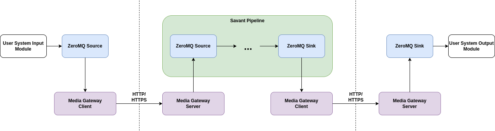

# Media Gateway

Media Gateway is a service that provides a secure bridge (with encryption and authentication) between Savant edge and
cloud components by forwarding messages from one ZeroMQ socket to another. The media gateway consists of two parts - a
server and client. The client reads messages from the source ZeroMQ socket and sends them to the server via HTTP/HTTPS.
The server writes received messages to the target ZeroMQ socket.

## Features

* HTTPS
* HTTP Basic authentication with [etcd](https://etcd.io/) as a credentials storage
* X509 client certificate authentication

## Documentation

The documentation is available at [GitHub Pages](https://insight-platform.github.io/MediaGateway/).

## License

Media Gateway is licensed under the BSL-1.1 license. See [LICENSE](LICENSE) for more information.

### Obtaining Production-Use License

To obtain a production-use license, please fill out the form
at [In-Sight Licensing](https://forms.gle/kstX7BrgzqrSLCJ18).
